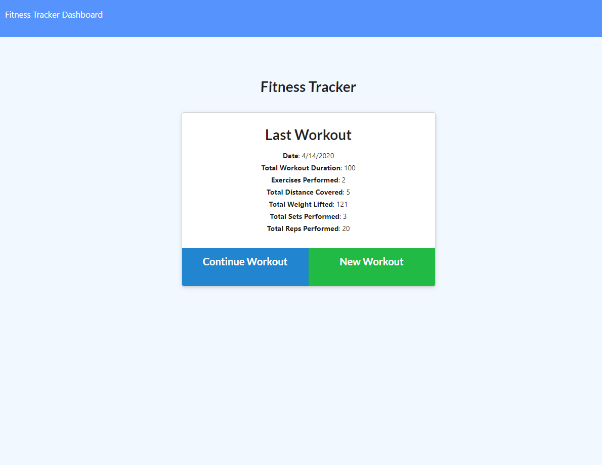

# Workout-Tracker
The  workout tracker use Mongo database with a Mongoose schema and handle routes with Express.
### Table of Contents
* General Info
* Deployed Link
* Technologies

### General Info
This app lets you view, create, and track daily workouts. You can log multiple exercises in a workout on a given day and track the name, type, weight, sets, reps, duration of exercise, and distance traveled if the exercise is a cardio exercise.

### Technologies
* JavaScript
* jQuery
* Node Js
* Express
* MongoDB
* Mongoose
## Submission on BCS

You are required to submit the following:

* The URL to the deployed application
https://ancient-beyond-52470.herokuapp.com/

* The URL to the GitHub repository
https://github.com/ru14/Workout-Tracker